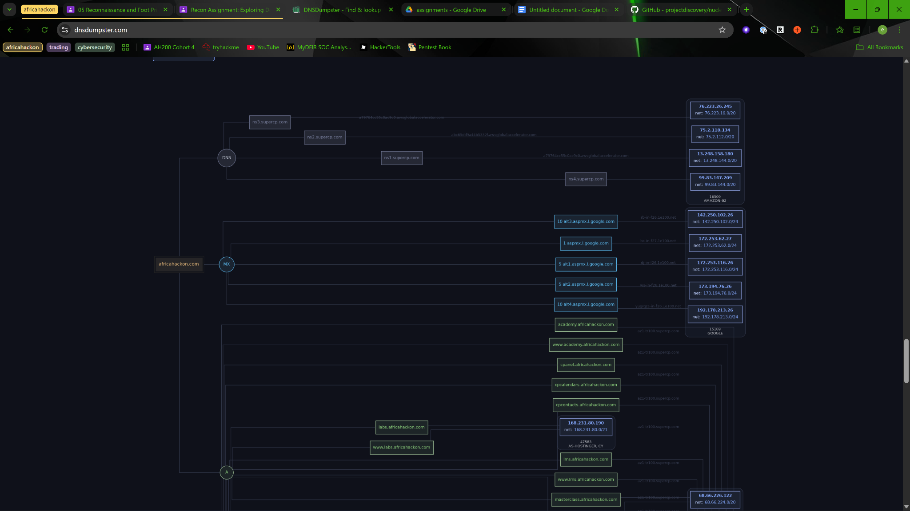
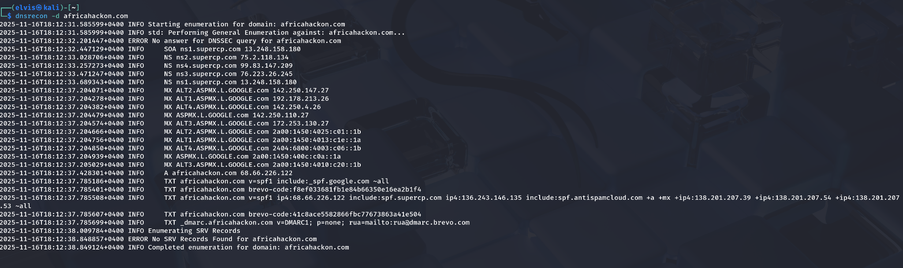
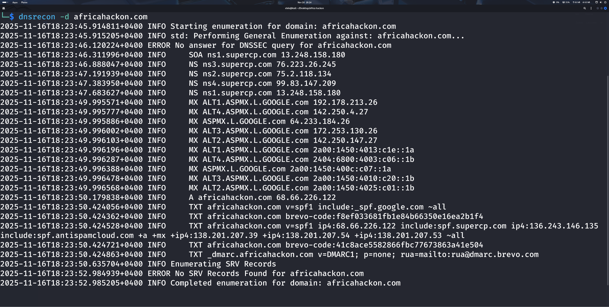
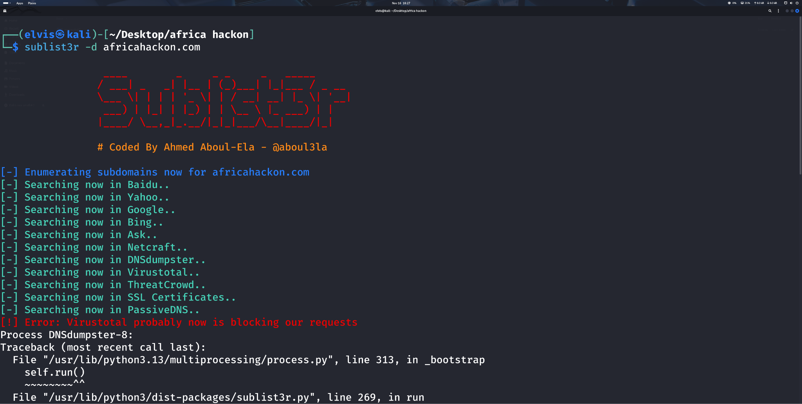
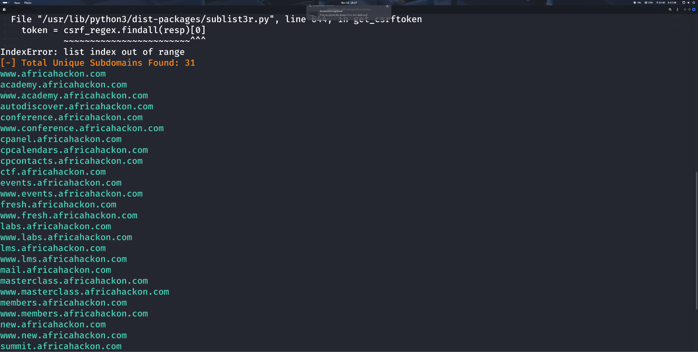
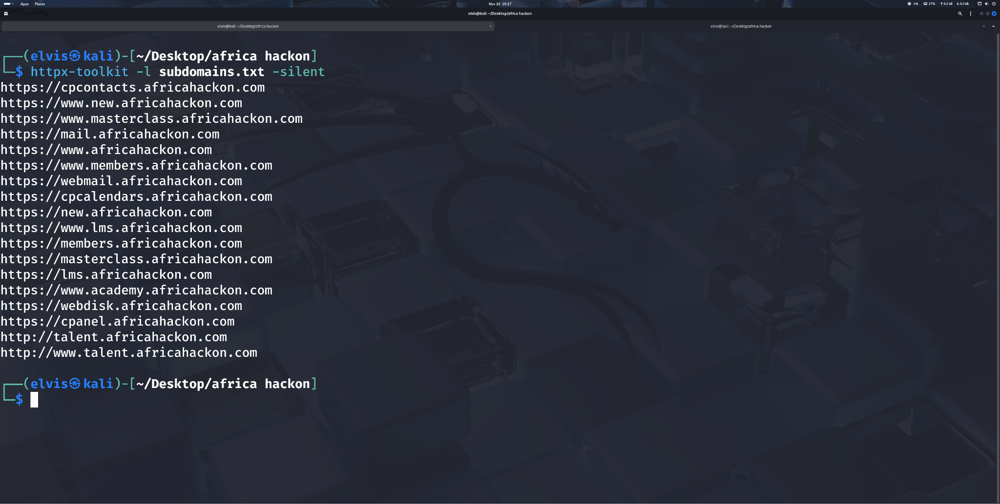
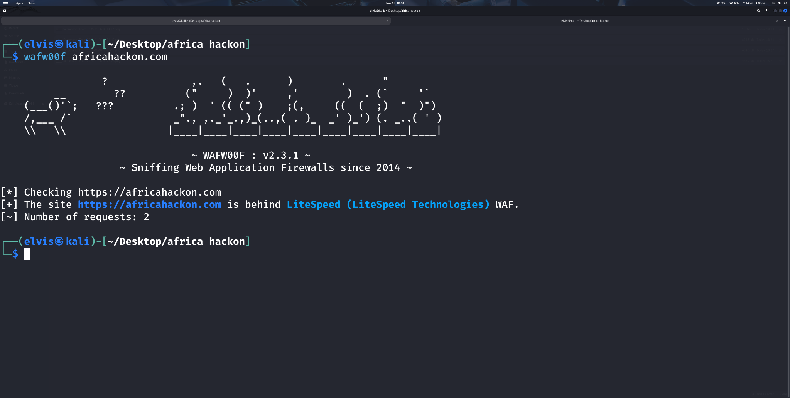

# External Attack Surface Reconnaissance

## Objective
Used multiple passive and active reconnaissance methods to enumerate subdomains, distinguish live from inactive assets, and inspect perimeter protections.

### Skills Learned
- Collected passive DNS and infrastructure relationships.
- Ran command-line subdomain enumeration and compared outputs.
- Separated responsive and non-responsive subdomains.
- Reviewed signs of firewall or edge protection on discovered hosts.

### Tools Used
- DNSDumpster
- DNSRecon
- Sublist3r
- DNS analysis
- host validation

## Steps

*Ref 1: 2.dns recon*

*Ref 2: 3.sublist3r*

*Ref 3: 3.sublist3r*

*Ref 4: 3.sublist3r*

*Ref 5: Separate both live and dead subdomains*

*Ref 6: Separate both live and dead subdomains*

*Ref 7: Use at least 5 of the tools we tried out in class. Not just subfinder.*

